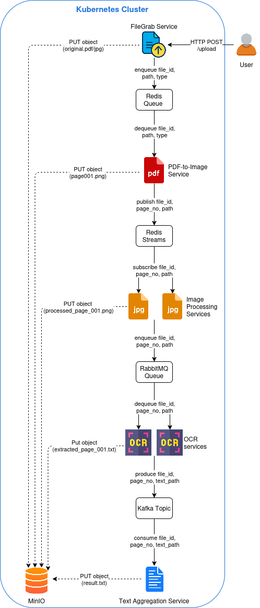

# Observability or Infrastructure as Code

## 1 Background

In this task you can choose between two substasks:

- **Observability**, in which you need to set up monitoring
- **Infrastructure as Code**, in which you need to deploy components
  using an Infrastructure as Code tool of your choosing (not
  Kubernetes YAMLs)

Both options build on the same microservice application consisting of
five independent services with hybrid messaging between them.  The
application is an image-to-text service that expects scanned book
pages as its input and provides the recognized text as its output.
The figure below illustrates the application's components and their
interactions.



The five services making up the application:

1. **FileGrab**: HTTP endpoint for file upload
2. **PDF-to-Image**: Converts PDF pages to PNG images using
   [PyMuPDF](https://pymupdf.readthedocs.io/en/latest/)
3. **Preprocessing**: Applies grayscale conversion and [Otsu
   binarization](https://en.wikipedia.org/wiki/Otsu%27s_method) for
   optical character recognition (OCR) accuracy
4. **OCR**: Extracts text using [Tesseract
   OCR](https://tesseract-ocr.github.io/)
5. **Text Aggregation**: Combines results into a final document

The microservices use a hybrid messaging architecture optimized for
different pipeline stages:

1. [Redis Queue](https://redis.io/glossary/redis-queue/): FileGrab →
   PDF-to-Image (simple queue)
2. [Redis
   Streams](https://redis.io/docs/latest/develop/data-types/streams/):
   PDF-to-Image → Preprocessing (parallel processing with consumer
   groups)
3. [RabbitMQ](https://www.rabbitmq.com/docs): Preprocessing → OCR
   (reliable message delivery)
4. [Kafka](https://kafka.apache.org/42/getting-started/introduction/)
   (with
   [ZooKeeper](https://www.redpanda.com/guides/kafka-architecture-kafka-zookeeper)):
   OCR → Text Aggregation (distributed streaming)

Additional technologies used:

- Storage:
  [MinIO](https://docs.min.io/enterprise/aistor-object-store/)
- Image processing: [OpenCV](https://opencv.org/),
  [NumPy](https://numpy.org/)

### 1.1 File structure

```
.
├── fig/                # Architecture figures for the microservice application
├── infra/              # Kubernetes infrastructure YAML files for the microservice application
├── monolith/           # Monolithic implementation for illustration
├── services/           # The five microservices
├── build-images.sh     # Docker image builder for K3s
├── cleanup.sh          # Resource cleanup script
├── README.md           # This file
├── test.pdf            # A sample input file for testing the application
└── setup.sh            # Full deployment script
```

### 1.2 Quick start

#### 1.2.1 Prerequisites

- AWS EC2 instance
- K3s Kubernetes cluster installed
- Docker installed
- Python 3.11+

These are available in the Kubernetes practice environment we provide
in the AWS Academy Learner Lab.

#### 1.2.2 Deploy microservices to Kubernetes

Start your AWS Academy Learner Lab and log in to the AWS Management
Console then open the following link in the same browser:

https://us-east-1.console.aws.amazon.com/cloudformation/home?region=us-east-1#/stacks/create/review?templateURL=https://vitmac12-resources.s3.amazonaws.com/k3s-multinode.template&stackName=vitmac13-homework

- Provide your Neptun ID.
- Set `Storage size of the Kubernetes server in GiB` to `25` to have
  ample storage space to work with.
- If you have another of our Kubernetes cluster deployed (e.g., because you are working on a lab):
  - In the `Initialization settings` change `Prefix` to some other
    text that you can easily identify.  This will be prepended to all
    AWS resource that are going to be created by the CloudFormation
    template.
- In the `Security group settings` section under `Allow cluster
  ingress from this CIDR block` select the appropriate option.  If you
  will work on your homework outside of BME's network use
  `Anywhere-IPv4--0.0.0.0-slash-0` or the `MyIP` option (in this case
  set your IP address, use this only if it does not change).
- In the `Capabilities and transforms` section, accept the three
  required points then click the `Create stack` button.
- When your Kubernetes node becomes ready, log in and navigate to the
  directory where this file is located.
- Issue the following command in the directory where this file is
  located to build and deploy all components: `./setup.sh`
- When the automated deployment finishes and all Kubernetes pods are
  up and running, upload a test file.  If you allowed cluster ingress
  from anywhere, this should work wherever you run the following
  command.  If you used the `MyIP` option, it'll work only from your
  machine.  If you left the default BME network, it will work only
  from there.  Use the following command by supplying the public IP
  address of your Kubernetes server EC2 instance:

  ```bash
      curl -X POST -F "file=@test.pdf" http://<public-ip>:30080/upload
  ```
- The output should look similar to this:

  ```bash
      {
        "job_id":"e6c8f60c-b5ea-4dee-8fdb-3466621a1ff6",
        "message":"File uploaded and queued for processing",
        "status":"success"
      }
  ```
- Open the MinIO console at `http://<public-ip>:30003`
  - Use `minioadmin` / `minioadmin` to log in.
  - Click the `Refresh` button.
  - In the `uploads` folder: check the name and last modified
    timestamp of the pdf file created.
  - Go to the `final-text` folder: select the subfolder with the name
    you saw in the previous step.
  - Click `document.txt` then click the `Download` button in the right
    pane to see the result.

Supported input file types: `.pdf`, `.png`, `.jpg`, `.jpeg`

You can also access the RabbitMQ Management console at
`http://<public-ip>:30672` (guest / guest)

### 1.3 Monolithic application

To help you understand how the application works, we also include a
monolithic implementation, which processes every page sequentially
(the microservice application uses parallel executions in some cases).
To see the monolithic application in action run the following
commands:

```bash
cd monolith

# Place test PDFs in the samples/ directory
docker build -t ocr-monolith .
docker run --rm \
  -v $PWD/samples:/app/samples \
  -v $PWD/output:/app/output \
  ocr-monolith
```

## 2 Subtasks

### 2.1 Observability

Modify the application components to expose the following metrics:

- For every component:
  - Component execution duration/latency.
  - CPU and memory usage.
- In every component other than `filegrab`:
 - Time elapsed between uploading the file and the current component
   finishing its processing task.
- In `pdf-to-image`:
  - Page count: number of pages in the current document.
- In `text-aggregation`:
  - Page count: number of pages aggregated.
  - Time elapsed between uploading the document and finishing its
    processing.
  - Total time spent on processing a document, i.e., each page adds
    time even if they are processed in parallel.  When there are
    multiple instances of the same service (e.g., OCR) this can be
    greater than the previous value.

Use a monitoring tool (e.g.,
[Prometheus](https://prometheus.io/docs/introduction/overview/)) to
collect the above metrics and the CPU and memory usage of the
Kubernetes node.

Use a visualization tool (e.g., [Grafana](https://grafana.com/docs/))
to create a dashboard to show the collected metrics.

This repository’s observability implementation should expose the
application metrics from each service and scrape them with Prometheus
together with node CPU and memory metrics from node-exporter. Grafana
should show both the wall-clock upload-to-finish time and the summed
document work time so parallel page processing is visible.

Expected access points after deployment:

- Prometheus: `http://<public-ip>:30900`
- Grafana: `http://<public-ip>:30300`
- FileGrab metrics: `http://<public-ip>:30080/metrics`

Key metrics to verify:

- `component_execution_seconds` for per-component processing latency.
- `process_cpu_seconds_total` and `process_resident_memory_bytes` for
  each service process.
- `document_upload_to_finish_seconds` for the elapsed time from upload
  to the end of each component.
- `document_page_count` for page counts in `pdf-to-image` and
  `text-aggregation`.
- `document_total_work_seconds` for the total summed work across all
  processed pages.

### 2.2 Infrastructure as Code

Select an Infrastructure as Code (IaC) tool for deployment automation.
Use the tool to automate the deployment and destruction of the five
microservices and one of the messaging service (you are free to choose
one).  We suggest the use of one of the following tools (you only need
to use one):

- [Terraform](https://developer.hashicorp.com/terraform):
  - developed and maintained by HashiCorp under the Business Source
    License (BUSL)
  - uses a specific declarative configuration language
  - allows deployment to multiple platforms (e.g., AWS, Azure, Google
    Cloud, Kubernetes)
- [OpenTofu](https://opentofu.org/docs/):
  - Linux Foundation-managed
  - licensed under Mozilla Public License (MPL) 2.0
  - otherwise quite similar to Terraform
- [Pulumi](https://www.pulumi.com/docs/):
  - provides IaC features in multiple popular programming languages
    (e.g., TypeScript, Python, Go, .NET, Java)
  - allows deployment to multiple platforms (e.g., AWS, Azure, Google
    Cloud, Kubernetes)
